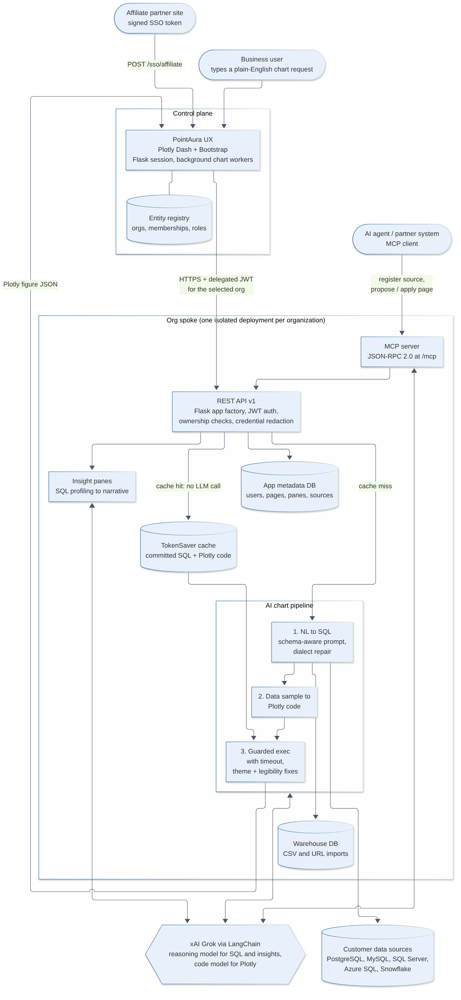

# PointAura

**Ask for a chart in plain English and get a live dashboard.** PointAura is an AI business-intelligence platform. A user describes the chart they want, and PointAura writes the SQL for the connected database, runs it, writes the Plotly code to visualize the result, and renders it in a multi-pane dashboard. Built on xAI Grok.

> **About this repository:** This is a public showcase. The product source code is private. **The full code is available to hiring teams on request**, and I'm happy to walk through it live.

**Role:** Designed and built solo by Rob Burkhart. I handled product design, architecture, backend, frontend, data layer, security, and ops tooling, using AI coding assistants throughout.

---

## What it does

1. **Connect data.** Register a PostgreSQL, MySQL, SQL Server, Azure SQL, or Snowflake source, or import a CSV by upload or URL (Google Drive links work too).
2. **Build pages.** Pick from 7 dashboard layouts (1 to 7 panes, including chart + narrative-insight pairs).
3. **Describe each pane in plain English.** For example: *"Monthly revenue by region as a stacked area chart, last 24 months."*
4. **PointAura does the rest.** Grok generates dialect-correct SQL against the live schema. The query runs. Grok then writes Plotly code for the result set, and the figure renders in the pane.
5. **Lock in what works.** **TokenSaver** commits a pane's approved SQL + chart code, so later page loads re-run the query on fresh data **without calling the LLM**. That cuts token cost and keeps charts stable.

## Key features

- **Two-stage NL → SQL → Plotly pipeline.** The two stages can use separate models: a reasoning model for SQL and insights, and a code-specialized model for Plotly. Both are configurable per deployment.
- **SQL repair layer.** Prompts are schema-aware, and LLM output is post-processed for each dialect: MySQL `ONLY_FULL_GROUP_BY` fixes; PostgreSQL identifier quoting, text/int and empty-date casts, and GROUP BY reconciliation; markdown-fence stripping.
- **Guarded execution of generated code.** Chart code runs in a restricted namespace with a timeout. Figures are then normalized: a consistent dark theme, automatic replacement of trace colors that would be invisible on the background, and map basemap fallbacks.
- **Insight panes.** PointAura profiles each chart's underlying data with SQL (numeric profiles, top categories, random samples) and has Grok write a concise narrative of what the page shows.
- **Prompt Toolbox.** A guided prompt builder with dozens of chart-type starters (Sankey, treemap, funnel, maps, candlestick, gauges, and more), axis/grid/marker options, a color picker, and a Data tab that assigns dimensions and measures with aggregations. Column names are quoted correctly for each SQL dialect.
- **MCP server.** A built-in Model Context Protocol endpoint (JSON-RPC 2.0) lets external AI agents register sources, inspect data, and have Grok **propose a whole dashboard page**, then apply it. Partners get scoped tokens, and every tool call is audited.
- **REST API v1.** About 35 endpoints for users, sources, pages, panes, chart rendering, insights, and TokenSaver commit/uncommit. JWT auth, ownership enforced with 404s (no existence leaks), source credentials never serialized, soft delete + restore, and chart-progress polling.
- **Multi-organization hosting (hub and spoke).** A control-plane UX and entity registry route each organization to its own isolated API + database "spoke". Includes delegated tokens, per-org xAI keys, role-based access (viewer / editor / admin), and SSRF validation on spoke addresses.
- **Affiliate SSO.** Partner sites can sign their users in with short-lived HMAC-signed tokens. Users are provisioned just-in-time with a starter workspace. Per-partner secrets have a rotate/deactivate CLI, and redirects are protected against open-redirect abuse.
- **Concurrent rendering.** The UI starts a background worker for each pane and shows staged progress (generating SQL → querying → writing chart code → rendering). Pages with many panes load in parallel.

## Architecture

Source: [`architecture.mmd`](architecture.mmd) (Mermaid)

- **UX:** a Plotly Dash + Dash Bootstrap single-page app on Flask, with signed-cookie sessions. It talks to the API over HTTP only, with no direct database access for tenant data.
- **API:** a Flask app-factory service with no import-time side effects, so tests can inject an in-memory SQLite engine. Ships with a standalone launcher and is gunicorn-ready.
- **Domain layer:** typed classes for users and auth methods, data sources (one subclass per database engine), pages, panes, charts, `ChartRenderer`, `InsightRenderer`, and `CsvImporter`. LangChain imports are lazy so the LLM client can be stubbed in tests.
- **Data layer:** SQLAlchemy 2.0 with a dialect-aware SQL helper, so the app metadata store runs on either PostgreSQL or MySQL. A separate warehouse database holds imported datasets. Includes a MySQL → PostgreSQL migration tool.
- **LLM:** xAI Grok via `langchain-xai` / LangChain. The SQL prompt receives schema and column metadata plus the user's request. The chart-code prompt receives a small sample of the result.

## Tech stack

| Area | Technologies |
|---|---|
| Language | Python 3 (plus Bash for ops scripts, Node.js for generated sales collateral) |
| AI | xAI Grok (reasoning + code models), LangChain (`langchain-core`, `langchain-community`, `langchain-xai`), Model Context Protocol |
| Frontend | Plotly Dash, Dash Bootstrap Components, Dash DAQ, Plotly (graph_objects / express / figure_factory) |
| Backend | Flask, Werkzeug, PyJWT, pandas, statsmodels |
| Data | SQLAlchemy 2.0, PostgreSQL (psycopg2), MySQL (PyMySQL), SQL Server / Azure SQL (pyodbc), Snowflake |
| Security | Werkzeug password hashing, HS256 JWTs, HMAC-signed SSO tokens, parameterized SQL, credential redaction |
| Ops | Bash dev runner (foreground / detached / status), one-command spoke deployment (venv + Postgres client + seed DB), pre-commit metadata-DB snapshot hook, backup / restore scripts |

## Engineering highlights

- **Evolved from prototype to platform.** It began as a single-file Dash app. I refactored it into a tested domain layer, a separately deployable REST API, and a thin UX, then added multi-org hosting and an MCP surface.
- **Security hardening pass.** Moved from plaintext to hashed passwords (with a backfill migration), converted SQL to bound parameters, removed URL-credential login, added credential redaction and ownership-by-404 in the API, plus SSRF and open-redirect guards.
- **LLM cost and stability controls.** TokenSaver caching, split SQL/code models, and deterministic post-processing of model output.
- **Tests.** Self-contained harnesses (no pytest dependency) cover JWT issue/verify, serializer redaction, Flask integration against in-memory SQLite, the user/auth domain model, and SSO hardening invariants.

## By the numbers

- About 29,000 lines of core Python across 11 modules (about 40,000 including utilities, migrations, and tests)
- 145 commits from April 2025 to September 2026
- 5 database engines supported as data sources, plus CSV / URL import
- About 35 REST endpoints and 8 MCP tools

## Screenshots

> _Placeholders. Screenshots to be added._

| | |
|---|---|
|    *Multi-pane dashboard* |    *Plain-English chart prompt* |
|    *Prompt Toolbox* |    *Generated Sankey diagram* |
|    *Geospatial chart* |    *Data source setup* |

## Code access

The source is in a private repository. **Code is available to hiring teams on request.** Contact me and I can grant temporary read access or do a screen-share walkthrough of the architecture, the chart pipeline, and the MCP integration.

---

© Rob Burkhart. PointAura is proprietary software. This showcase contains no product source code.
